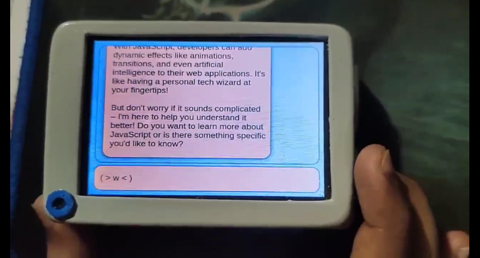
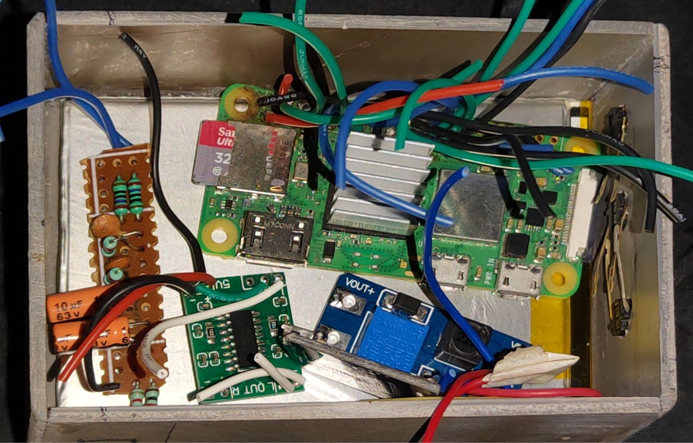
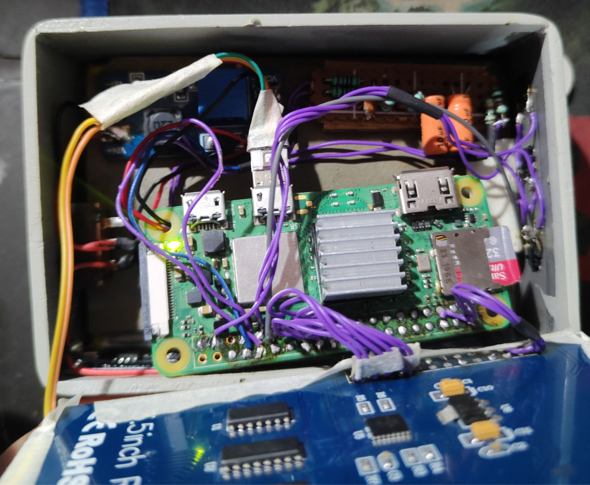

# ZELNA-handheld-assistant

> ## TL;DR
> **ZELNA** is a smart handheld assistant that runs completely locally on your home server or personal computer.  
> It integrates with a Raspberry Pi-based handheld device and offers features such as:
> - Speech-to-text  
> - Text-to-speech  
> - A simple and minimal GUI  
>
> The client-side is built using Python and PyQt5, making it easily portable to other devices like smartphones, tablets, or desktops — so your local assistant can be accessible anywhere.

---

---

## How the Handheld Works

This video demonstrates the handheld assistant connected to a locally running server.  
Both **speech-to-text** and **text-to-speech** work seamlessly.

---

## Hardware Components

  

> **Hardware includes:**
> - Raspberry Pi Zero 2 W  
> - 3.5-inch LCD display  
> - USB microphone  
> - 2300mAh battery  
> - Boost converter  
> - TP4056 charging module  
> - PAM8403 audio amplifier  
> - Speaker  
> - Custom modules:
>   - Low-pass RC filter for PWM audio  
>   - Charge detection circuit using LM393 comparator IC  

---

## Software Stack

- **PyQt5** – GUI frontend  
- **Ollama** – Local LLM model serving  
- **Vosk** – Offline speech-to-text  
- **pyttsx3** – Offline text-to-speech  
- **Flask** – Backend server framework  
- **Flask-SocketIO** – WebSocket integration for real-time communication  

All software components are **open source** and run fully offline.

---

## Project Goals

- Fully local AI assistant (no cloud dependencies)  
- Portable UI for any device  
- Lightweight and modular codebase  
- Easy to hack, modify, and extend

---

## License

This project is open source. Feel free to use, modify, and contribute.

